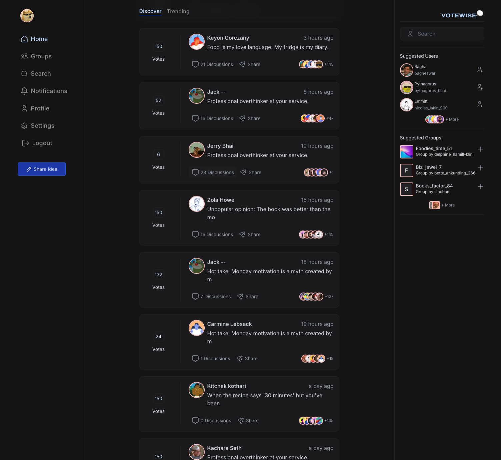
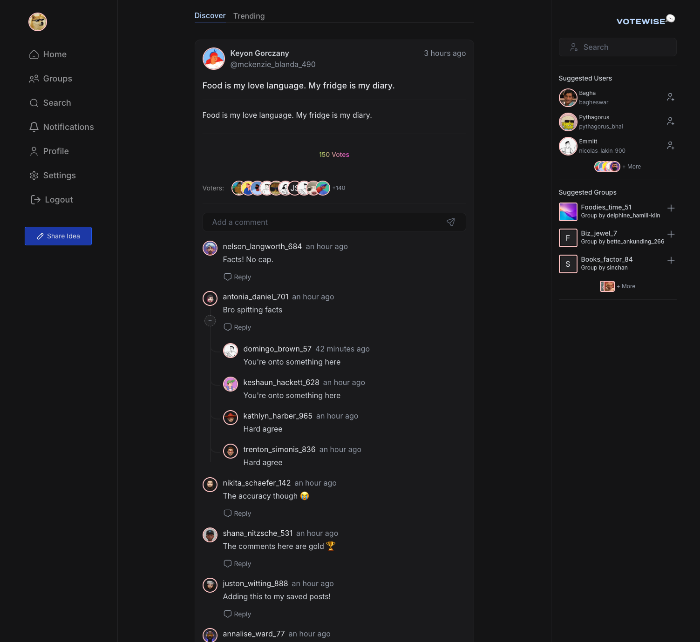
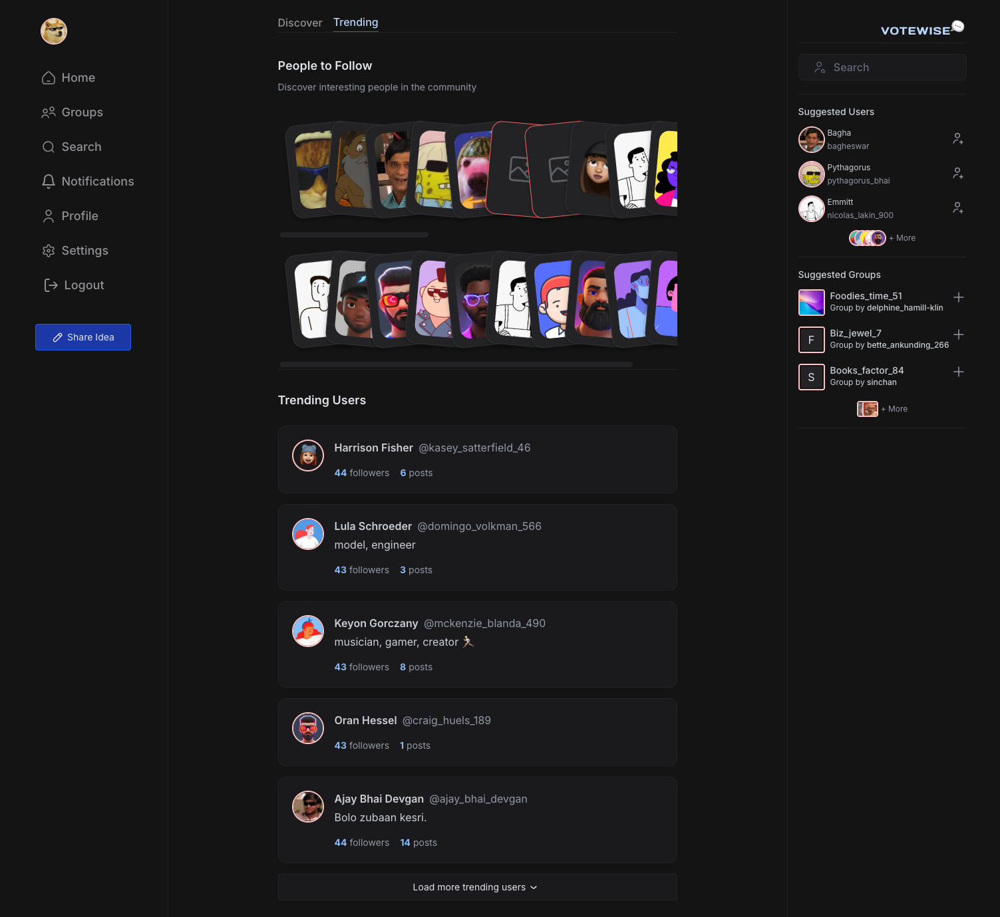
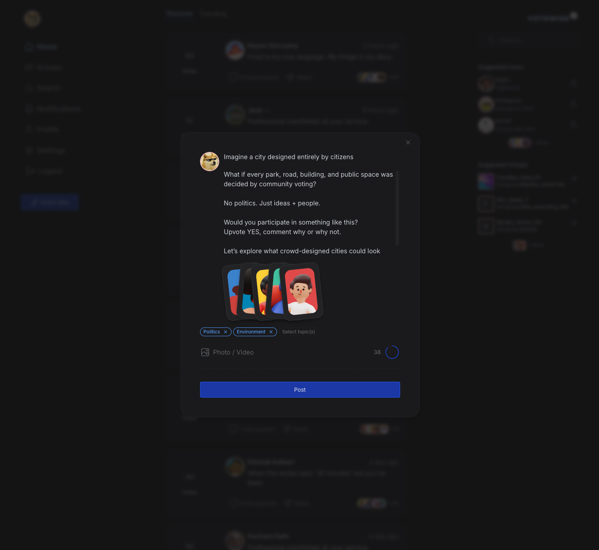

<div align="center">
  

  <p><strong>A social platform where users connect, share thoughts, and vote on ideas</strong></p>

  <p>
    <a href="#features">Features</a> •
    <a href="#tech-stack">Tech Stack</a> •
    <a href="#architecture">Architecture</a> •
    <a href="#getting-started">Getting Started</a> •
  </p>
</div>

---

> **Note:** Personal side project built during weekends and free hours.

---

## Overview

Votewise is a social platform that enables users to share their thoughts, and vote on content. The platform supports both public posts and private group discussions, real-time notifications, and a comprehensive user interactions.






## Features

- **Thought Sharing** — Create and share posts with text and media attachments
- **Voting System** — Upvote posts and comments with a bucket-based vote allocation
- **Discussions** — Discuss posts through threaded comments
- **User Profiles** — Customizable profiles with avatars, cover images, and social links
- **Follow System** — Follow users to see their content in your timeline
- **Groups** — Create public or private groups with role-based membership (Admin, Moderator, Member)
- **Group Invitations** — Invite users or request to join groups
- **Onboarding Flow** — Guided setup for new users with interest selection
- **Real-time Notifications** — WebSocket-powered instant notifications
- **Timeline Feed** — Personalized content feed based on follows and interests
- **Trending Content** — Discover popular posts and hashtags
- **Media Uploads** — Attach images and files to posts
- **Two-Factor Authentication** — TOTP-based 2FA support
- **Email Verification** — Secure account verification via email

## Tech Stack

### Frontend

| Technology          | Purpose                                   |
| ------------------- | ----------------------------------------- |
| **Next.js**         | React meta-framework with SSR support     |
| **React**           | UI library                                |
| **TypeScript**      | Type-safe development                     |
| **Tailwind CSS**    | Utility-first styling                     |
| **Radix UI**        | Accessible component primitives           |
| **Floating UI**     | Positioning engine for tooltips, popovers |
| **TanStack Query**  | Server state management and data fetching |
| **Jotai**           | Client state management                   |
| **React Hook Form** | Form handling with Zod validation         |

### Backend

| Technology         | Purpose                             |
| ------------------ | ----------------------------------- |
| **Node.js**        | Runtime environment                 |
| **Express**        | Web framework                       |
| **TypeScript**     | Type-safe development               |
| **Kysely**         | Type-safe SQL query builder         |
| **PostgreSQL**     | Primary database                    |
| **Redis**          | Caching layer                       |
| **BullMQ**         | Job queue for background processing |
| **WebSocket (ws)** | Real-time communication             |

### Infrastructure & Tooling

| Technology            | Purpose                     |
| --------------------- | --------------------------- |
| **Nx**                | Monorepo build system       |
| **Lerna**             | Monorepo package management |
| **Nginx**             | Reverse proxy               |
| **Storybook**         | Component documentation     |
| **Jest**              | Testing framework           |
| **ESLint / Prettier** | Code quality                |
| **Husky**             | Git hooks                   |
| **Commitlint**        | Conventional commits        |

## Architecture

```
votewise/
├── apps/
│   ├── web/                    # Next.js frontend application
│   └── storybook/              # Storybook for UI components
├── services/
│   ├── api/                    # Votewise REST API
│   ├── upload/                 # File upload and serving service with image processing on the fly
│   └── ml/                     # Machine learning service (Python)
├── packages/
│   ├── ui/                     # Shared UI component library
│   ├── client/                 # API client for communicating with the API and upload services
│   ├── schemas/                # Zod schemas
│   ├── db/                     # Database layer using kysely
│   ├── types/                  # Shared TypeScript types
│   ├── config/                 # Shared configurations (Tailwind, Prettier)
│   ├── tsconfig/               # TypeScript configurations
│   └── common/
│       ├── constant/           # Application constants
│       ├── crypto/             # Cryptography utilities
│       ├── env/                # Environment configuration
│       ├── errors/             # Custom error classes
│       ├── event/              # Event emitter utilities
│       ├── jwt/                # JWT handling
│       ├── log/                # Logging utilities
│       ├── text/               # Text manipulation
│       └── times/              # Date/time utilities
└── infra/                      # Docker and Nginx configuration
```

## Getting Started

### Prerequisites

- Node.js 22+
- Yarn
- PostgreSQL
- Redis
- Docker (optional)

### Installation

```bash
# Clone the repository
git clone https://github.com/xambassador/votewise.git
cd votewise

# Start docker containers
docker-compose -f ./infra/docker-compose.dev.yml up -d

# Install dependencies
yarn install

# Set up environment variables
echo "services/api services/upload services/ml apps/web packages/db" | xargs -n1 -I{} cp .env.example {}/.env

# Run database migrations
yarn db:migrate

# Run seed script to populate initial data
yarn db:seed
```

### Development

Make sure nginx is running either in Docker or locally. You can use the Docker compose file from `infra` directory. If running locally, ensure to set up the configuration as per `infra/nginx.conf`.

```bash
yarn dev
```

Visit `http://localhost` to access the application. (If nginx is listening on default port 80)

## License

This project is licensed under the MIT License. See the [LICENSE](LICENSE) file for details.
